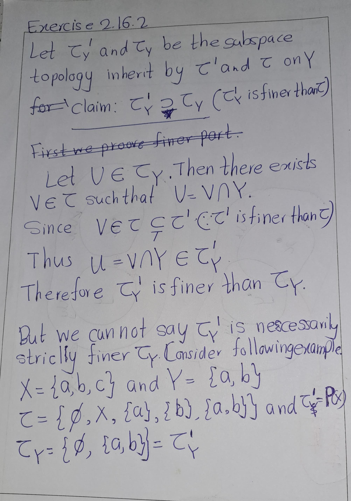
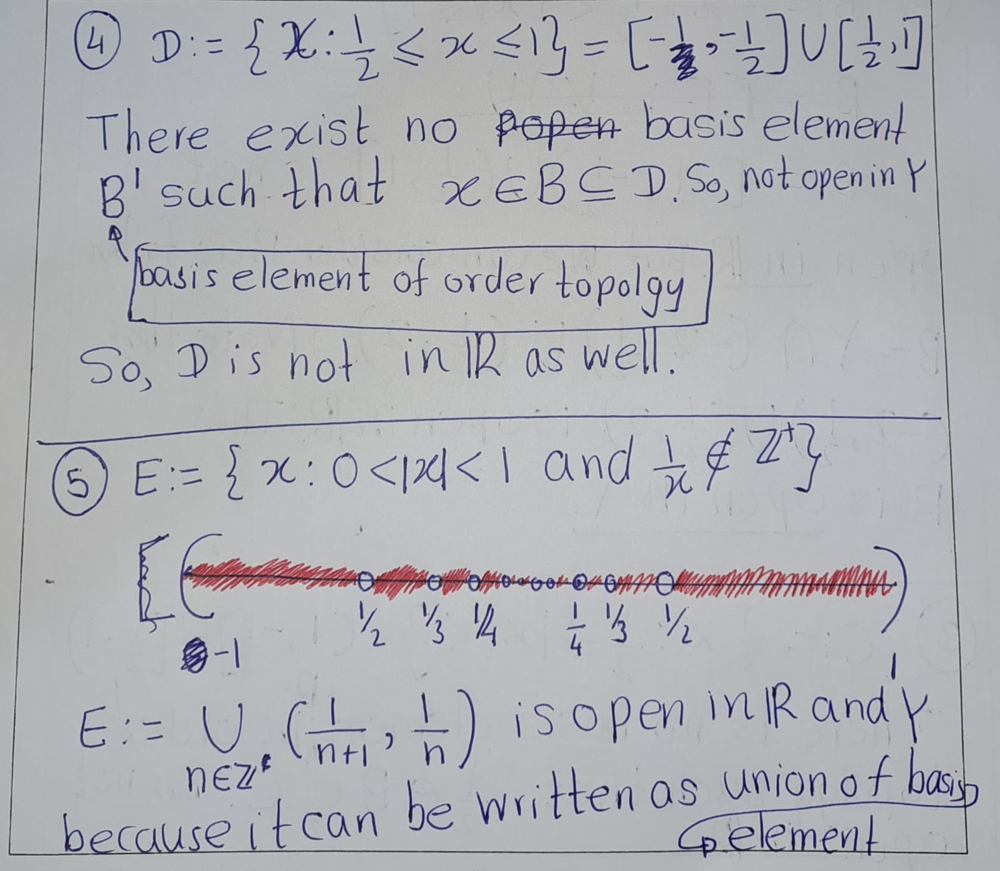

# Exercises
## Section 16 in Munkress Book

```{exercise,name='Mun 2.16.2' }
Show that if $Y$ is a subspace of $X, and $A$ is a subset of $Y$ , then the topology $A$ inherits as a subspace of $Y$ is the same as the topology it inherits as a subspace of $X$.
```
**Solution**: 
Let's denote the topology on $X$ as $\mathcal{T}_X$, the topology on $Y$ as $\mathcal{T}_Y$, and the topology on $A$ as $\mathcal{T}_A$. 

We know that $Y$ is a subspace of $X$, so the topology $\mathcal{T}_Y$ that $Y$ inherits from $X$ is $\mathcal{T}_Y = \{ Y \cap U : U \in \mathcal{T}_X \}$.

Similarly, $A$ is a subset of $Y$, so the topology $\mathcal{T}_A$ that $A$ inherits from $Y$ is $\mathcal{T}_A = \{ A \cap V : V \in \mathcal{T}_Y \}$.

Substituting $\mathcal{T}_Y$ into the equation for $\mathcal{T}_A$, we get $\mathcal{T}_A = \{ A \cap (Y \cap U) : U \in \mathcal{T}_X \}$.

Since $A$ is a subset of $Y$, $A \cap Y = A$. So, $\mathcal{T}_A = \{ A \cap U : U \in \mathcal{T}_X \}$.

This is exactly the topology that $A$ would inherit as a subspace of $X$. Therefore, the topology $A$ inherits as a subspace of $Y$ is the same as the topology it inherits as a subspace of $X$.

```{r echo=FALSE}
  knitr::include_graphics('figures/Exercises/Ex 2.16/ex1-1.png') 
```

```{r echo=FALSE}
  knitr::include_graphics('figures/Exercises/Ex 2.16/ex1-2.png') 
```

```{exercise,name='Mun 2.16.2'}
If $\mathcal{T}$ and $\mathcal{T}$ are topologies on $X$ and $\mathcal{T}$ is strictly finer than $\mathcal{T}$ , what can you
say about the corresponding subspace topologies on the subset $Y$ of $X$?
```
**Solution**:
```{r echo=FALSE}
   
```

```{exercise,name='Mun 2.16.3'}
Consider the set $Y = [−1, 1]$ as a subspace of $\mathbb{R}$. Which of the following sets are open in $Y$ ? Which are open in $\mathbb{R}$?
\begin{align}
A &= \{ x \mid \frac{1}{2} < |x| < 1 \}\\ 
B &= \{ x \mid \frac{1}{2} < |x| \leq 1 \} \\
C &= \{ x \mid \frac{1}{2} \leq |x| < 1 \}\\
D &= \{ x \mid \frac{1}{2} \leq |x| \leq 1 \}\\
E &= \{ x \mid 0 < |x| < 1 \text{ and } \frac{1}{x} \notin \mathbb{Z}^+ \}
\end{align}
```

**Solution**:
```{r echo=FALSE}
  knitr::include_graphics('figures/Exercises/Ex 2.16/ex 3-1.jpg') 
```

```{r echo=FALSE}
   
```

```{exercise}
A map \(f : X \to Y\). We say that \(f\) is an **open map** if, for every open set \(U\) in \(X\), the set \(f(U)\) is open in \(Y\). Show that the projections \(\pi_1 : X \times Y \to X\) and \(\pi_2 : X \times Y \to Y\) are open maps.
``


```{exercise}
Let $X$ and $X^\prime$ denote a single set in the topologies $\mathcal{T}$ and $\mathcal{T}^\prime$ , respectively; let $Y$
and $Y'$ denote a single set in the topologies $\mathcal{U}$ and $\mathcal{U}^\prime$, respectively. Assume these sets are nonempty.

(a) Show that if $\mathcal{T}' \supset  \mathcal{T}$ and $\mathcal{U}'\supset \mathcal{U}$, then the product topology on $X'\times Y'$ is
finer than the product topology on $X \times Y$.
(a) Does the converse of a. hold? Justify your answer
```
```{exercise,name='Mun 2.16.7'}
Show that the countable collection 
$$\{(a, b) \times (c, d) | a < b \text{ and } c < d, \text{ and } a, b, c, d \text{ are rational}\}$$
is a basis for $\mathbb{R}^2$."
```

```{exercise}

Let $X$ be an ordered set. If $Y$ is a proper subset of $X$ that is convex in $X$, does it follow that $Y$ is an interval or a ray in $X$?
```

```{exercise}
If $L$ is a straight line in the plane, describe the topology $L$ inherits as a subspace of $\mathbb{R}_l \times \mathbb{R}$ and as a subspace of $\mathbb{R}_l \times \mathbb{R}_l$. In each case it is a familiar topology.
```

```{exercise}
Show that the dictionary order topology on the set $\mathbb{R} \times \mathbb{R}$ is the same as the product topology $\mathbb{R}_d \times \mathbb{R}$, where $\mathbb{R}_d$ denotes $\mathbb{R}$ in the discrete topology. Compare this topology with the standard topology on $\mathbb{R}^2$.
```

\[\mathbb{R}^2_{dictionary}:=\mathbb{R}_{discrete }\times \mathbb{R}_{standard}\]

```{proof}
Let $\{a\} \times (c,d)$ be a basis element in product toplogy $\mathbb{R}_d \times \mathbb{R}$. Let $a\times x\in \{a\} \times (c,d)$ obsereve that 
\[a\times x\in \{a\} \times (c,d) = (a\times c,a\times d)\]
and $(a\times c,a\times d)$ is basis element of order topology $\mathbb{R}^2$. Thus by lemma \@ref(lem:finerLemma), order toplogy in $\mathbb{R}^2$  is finer than the product toplogy $\mathbb{R}_d \times \mathbb{R}$.

Now suppose that $(p\times q, r \times s)$ be a basis elemenet in order toplogy on $\mathbb{R}^2$. 


- If $p<x$, define $l=y−1$ and if $p=x$ define $l=r$. In either case we know that $(p\times q)<(x\times l)<(x\times y)$. 
- If $x<r$ define $t=y+1$ and if $x=r$ define $t=s$. In either case we know that $(x\times y)<(x\times t)<(q \times s)$. 

See figure \@ref(fig:fig12)
So \[(x,y) \in \{x\} \times (l,t) \subseteq (p \times q, r \times s).\] 
 Thus by lemma \@ref(lem:finerLemma), product toplogy $\mathbb{R}_d \times \mathbb{R}$ is finer than order toplogy in $\mathbb{R}^2$.                   

Therefore, \[\mathbb{R}^2_{dictionary}=\mathbb{R}_{discrete }\times \mathbb{R}_{standard}\]
```

```{r echo=FALSE,fig.cap='$~$',label='figm12'}
  knitr::include_graphics('figures/figure 12.jpg') 
```

Let $I = [0, 1]$. Compare the product topology on $I \times I$, the dictionary order topology on $I \times I$, and the topology $I \times I$ inherits as a subspace of $\mathbb{R} \times \mathbb{R}$ in the dictionary order topology.

```{r echo=FALSE,label='fige101'}
  knitr::include_graphics('figures/Exercises/Ex 2.16/ex-10-1.png') 
```
```{r echo=FALSE,label='fige102'}
  knitr::include_graphics('figures/Exercises/Ex 2.16/ex-10-2.png') 
```
```{r echo=FALSE,label='fige103'}
  knitr::include_graphics('figures/Exercises/Ex 2.16/ex-10-3.png') 
```
```{r echo=FALSE,label='fige104'}
  knitr::include_graphics('figures/Exercises/Ex 2.16/ex-10-4.png') 
```
```{r echo=FALSE,label='fige105'}
  knitr::include_graphics('figures/Exercises/Ex 2.16/ex-10-5.png') 
```

**Claim**: $\mathcal{T_2}\subsetneq\mathcal{T3}$\
So, as previous we have to prove two things they are finer condition and strictly condition.

Let $(a_1\times b_1, a_2 \times b_2)$ be a basis element of order topology. and $x\times y \in (a_1\times b_1, a_2 \times b_2)$

- **Case I** $(a_1<x<a_2)$: 
\[x\times y \in (x\times-1,x\times 2)\cap I^2= [x\times 0,x\times 1]=\{x\}\times [0,1] \subset (a_1\times b_1, a_2 \times b_2)\]
Note that $(x\times -1,x\times 2)\cap I^2$ is a basis element of subspace topology. 

- **Case II** $(a_1=x<a_2)$: 
\[x\times y \in (x\times b_1,x\times 2)\cap I^2= [x\times b_1,x\times 1]=\{x\}\times (b_1,1] \subset (a_1\times b_1, a_2 \times b_2)\]
Note that $(x\times b_1,x\times 2)\cap I^2$ is a basis element of subspace topology. 

- **Case III** $(a_1<x=a_2)$: 
\[x\times y \in (x\times -1,x\times b_2)\cap I^2= [x\times 0,x\times b_2]=\{x\}\times [0,b_2) \subset (a_1\times b_1, a_2 \times b_2)\]
Note that $(x\times -1,x\times b_2)\cap I^2$ is a basis element of subspace topology. 
  
- **Case IV** $(a_1=x=a_2)$: 
\[x\times y \in (x\times b_1,x\times b_2)\cap I^2= [x\times b_1,x\times b_2]=\{x\}\times [b_1,b_2) \subset (a_1\times b_1, a_2 \times b_2)\]
Note that $(x\times b_1,x\times b_2)\cap I^2$ is a basis element of subspace topology.

See figure \@ref(fig:fige15)
  
In above all four cases, we have found basis element of subspace topology that contain $x\times y$ and contained in $(a_1\times b_1, a_2 \times b_2)$. Therefore,  $\mathcal{T_2}\subsetneq\mathcal{T3}$


```{r echo=FALSE,fig.cap='$~$',label='fige15'}
  knitr::include_graphics('figures/figure 15.jpg') 
```

```{r echo=FALSE,label='fige1056',fig.align='center'}
  knitr::include_graphics('figures/Exercises/Ex 2.16/ex-10-6.png') 
```
```{r echo=FALSE,label='fige1057',fig.align='center'}
  knitr::include_graphics('figures/Exercises/Ex 2.16/ex-10-7.png') 
```
```{r echo=FALSE,label='fige1058',fig.align='center'}
  knitr::include_graphics('figures/Exercises/Ex 2.16/ex-10-8.png') 
```


## Section 17 in Munkress Book

```{exercise,name='Mun 2.17.1' }
Let $\mathcal{C}$ be a collection of subsets of the set $X$. Suppose that $$\emptyset and $X$ are in  $\mathcal{C}$, and that finite unions and arbitrary intersections of elements of  $\mathcal{C}$ are in  $\mathcal{C}$. Show that the collection
\[\mathcal{T} = \{X \setminus C  | C\in  \mathcal{C}\}\]
is a topology on X.
```

**Solution**:

```{proof}
- (T1)
  - $\emptyset \in \mathcal{C}\implies X\setminus \emptyset=X \in \mathcal{T}$.
  - $X \in \mathcal{C}\implies X\setminus X=\emptyset \in \mathcal{T}$
- (T2)
Let $\{U_\alpha\}_{\alpha\in J}$ be family of elements in $\mathcal{C}$. Then $(X\setminus U_\alpha\}_{\alpha\in J}\in \mathcal{T}$. Then,
\[\bigcup_{\alpha\in J}(X\setminus U_\alpha)=X\setminus \bigcup_{\alpha\in J}U_\alpha\]
Since $\mathcal{C}$ is closed arbitrary intersection, $\bigcup_{\alpha\in J}\in \mathcal{C}$. Thus,$\bigcap_{\alpha\in J}(X\setminus U_\alpha)=X\setminus \bigcup_{\alpha\in J}U_\alpha\in \mathcal{T}$.
- (T3)
Let $U_1,U_2,...,U_n\in \mathcal{C}$. Then $(X\setminus U_1),(X\setminus U_2),...,(X\setminus U_n)\in \mathcal{T}$. Then,
\[\bigcap_{i=1}^n(X\setminus U_i)=X\setminus \bigcup_{i=1}^nU_i\]
Since $\mathcal{C}$ is closed under finite union, $\bigcup_{i=1}^nU_i\in \mathcal{C}$. Thus,$\bigcap_{i=1}^n(X\setminus U_i)=X\setminus \bigcup_{i=1}^nU_i\in \mathcal{T}$.
Therefore $\mathcal{T}$ is a topology on $X$.
```

```{exercise,name='Mun 2.17.2' }
Show that if $A$ is closed in $Y$ and $Y$ is closed in $X$, then $A$ is closed in $X$.
```

```{proof}
Suppose that $A$ is closed in $Y$ and $Y$ is closed in $X$.
```

```{proof}
 Since $Y$ is subspace in $X$ and $A$ is closed in $Y$, by theorm \@ref(thm:qw), then there exist closed set $C$ in $X$ such that \[A=Y\cap C\]
Since, $Y$ is closed in $X$ and $X$ is toplogical space, $A=Y\cap C$ is closed in  $X$. 
```