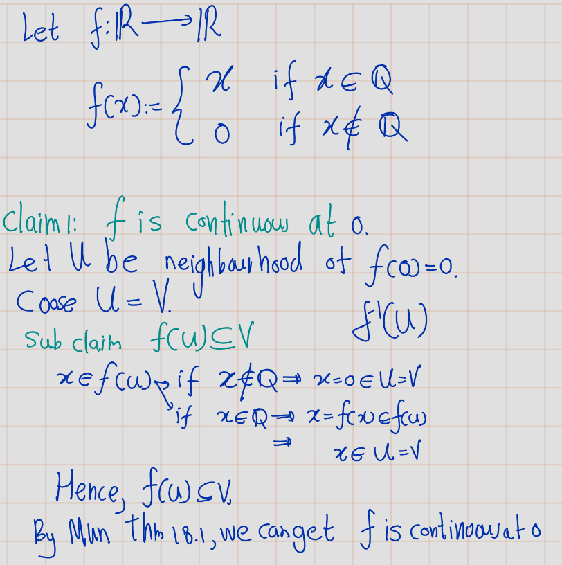

# Exercises

## Section 13 in Munkrees book
```{exercise,name='Mun 2.13.1'}
Let $X$ be a topological space; let $A$ be a subset of $X$. Suppose that for each $x \in A$ there is an open set $U$ containing $x$ such that $U \subset A$. Show that $A$ is open in $X$.
```


```{proof}
Let $X$ be a topological space. Let $A$ be a subset of $X$. Suppose that for each $x \in A$. Then $U_x$ be the open set that,
\[x\in U_x\subseteq A\]
Now consider,
\[U:=\bigcup_{x\in A}U_x.\]
Note that $U$ is open. By defintion of toplogy.
Furthur, $A=U$. Hence, $A$ is open set.
```

```{exercise,name='Mun 2.13.3'}
Consider the nine topologies on the set X = {a, b, c} indicated in Example 1 of §12. Compare them; that is, for each pair of topologies, determine whether they are comparable, and if so, which is the finer.
```

```{r echo=FALSE,fig.cap='$~$',label='fig1'}
  knitr::include_graphics('figures/figure 01.png') 
```

These topologies can be listed as follows,
\begin{align*}
\mathcal{T}_1 &= \{\emptyset, X\}, \\
\mathcal{T}_2 &= \{\emptyset, \{a\}, \{a, b\}, X\}, \\
\mathcal{T}_3 &= \{\emptyset, \{b\}, \{a, b\}, \{b, c\}, X\}, \\
\mathcal{T}_4 &= \{\emptyset, \{b\}, X\}, \\
\mathcal{T}_5 &= \{\emptyset, \{a\}, \{b, c\}, X\}, \\
\mathcal{T}_6 &= \{\emptyset, \{b\}, \{c\}, \{a, b\}, \{b, c\}, X\}, \\
\mathcal{T}_7 &= \{\emptyset, \{a, b\}, X\}, \\
\mathcal{T}_8 &= \{\emptyset, \{a\}, \{b\}, \{a, b\}, X\}, \\
\mathcal{T}_9 &= \{\emptyset, \{a\}, \{b\}, \{c\}, \{a, b\}, \{a, c\}, \{b, c\}, X\}.
\end{align*}
We can get following observations.
- $\mathcal{T}_1$ is coarser than any other topology, 
- $\mathcal{T}_9$ is finer than any other topology. 
- $\mathcal{T}_7 \subset \mathcal{T}_2 \subset \mathcal{T}_8$
- $\mathcal{T}_4 \subset \mathcal{T}_3 \subset \mathcal{T}_6$
- $\mathcal{T}_7 \subset \mathcal{T}_3 \subset \mathcal{T}_6$
- $\mathcal{T}_4 \subset \mathcal{T}_8$.

```{exercise}
Show that the collection $\mathcal{T}_c$ given in Example 4 of §12 (in Munkrees book) is a topology on the set $X$.
Is the collection
   \[\mathcal{T}_{\infty} = \{U | X - U \text{ is infinite or empty or all of } X\}\]
a topology on $X$?
```

```{proof}
(Proof of $\mathcal{T}_c$ is toplogy.)
Recall: $\mathcal{T}_c$ is the collection of all subsets $U$ of $X$ such that $X \setminus U$ is either countable or is all of $X$. 

- $\emptyset\in \mathcal{T}_c$. (Beacuse $X\setminus \emptyset=X$)\
$X \in \mathcal{T}_c$. (Beacuse $X\setminus X=\emptyset$ is countable)\
So, $\emptyset$ and $X$ are both in $\mathcal{T}_c$.

- Let $\{U_\alpha\}_{\alpha \in J}$ be a family of sets in $\mathcal{T}_c$. Then
\[X \setminus \bigcup_{\alpha \in J} U_\alpha = \bigcap_{\alpha \in J} (X \setminus U_\alpha)\quad\text{ (By De Moragons Law)}\]
is an intersection of countable sets, hence countable. 

- If $U_1, \ldots, U_n$ are elements in $\mathcal{T}_c$, then
\[X \setminus \bigcap_{i=1}^{n} U_i = \bigcup_{i=1}^{n} (X \setminus U_i)quad\text{ (By De Moragons Law)}\]
is countable being a union of countable sets. It follows that $\mathcal{T}_c$ is a topology on $X$.
```
Note that $\mathcal{T}_\infty$ is in general not a topology on $X$. 

- For example, let $X = \mathbb{R}$, \
$U_1 = (-\infty, 0)$ and $U_2 = (0, \infty)$.\
Then $U_1$ and $U_2$ are in $\mathcal{T}_\infty$ but $U_1 \cup U_2 = \mathbb{R} \setminus \{0\}$ is not.

```{exercise,name='Mun 2.13.4'}

(a) If $\{\mathcal{T}_\alpha\}$ is a family of topologies on $X$, show that $\bigcap \mathcal{T}_\alpha$ is a topology on $X$. Is $\bigcup \mathcal{T}_\alpha$ a topology on $X$?
(b) Let $\{\mathcal{T}_\alpha\}$ be a family of topologies on $X$. Show that there is a unique smallest topology on $X$ containing all the collections $\mathcal{T}_\alpha$, and a unique largest topology contained in all $\mathcal{T}_\alpha$.
(c) If $X = \{a, b, c\}$, let
\begin{align*}
\mathcal{T}_1 &= \{\emptyset, X,\{a\},\{a, b\}\} \text{ and } \\
\mathcal{T}_2 &= \{\emptyset, X,\{a\},\{b, c\}\}.
\end{align*}
Find the smallest topology containing $\mathcal{T}_1$ and $\mathcal{T}_2$, and the largest topology contained in $\mathcal{T}_1$ and $\mathcal{T}_2$.
```
**Solution**:

a) 

```{r echo=FALSE}
   
```

```{r echo=FALSE}
   
```

b)

Let Let $\{\mathcal{T}_\alpha\}$ be a family of topologies on $X$.
Let $\mathcal{F}:\{\mathcal{T}_\beta: \mathcal{T}_\beta\supseteq \bigcup \mathcal{T}_\alpha\}$ be  family of topology that contain $\bigcup\mathcal{T}_\alpha$.


```{r echo=FALSE}
   
```
c)

```{r echo=FALSE}
   
```

```{exercise,name='Mun 2.13.5'}
Show that if $A$ is a basis for a topology on $X$, then the topology generated by $A$ equals the intersection of all topologies on $X$ that contain $A$. Prove the same if $A$ is a subbasis.
```


```{r echo=FALSE}
   
```
```{r echo=FALSE}
   
```
```{r echo=FALSE}
   
```

```{exercise,name='Mun 2.13.6'}
Show that the topologies of $\mathbb{R}_l$ and $\mathbb{R}_K$ are not comparable.
```
```{r echo=FALSE}
   
```
```{r echo=FALSE}
  knitr::include_graphics('figures/Exercises/Ex 2.13/ex-6-2.png') 
```

```{exercise,name='Mun 2.13.7'}
Consider the following topologies on $\mathbb{R}$:
\begin{eqnarray}
\mathcal{T}_1 &:=& \text{ the standard topology}\\
\mathcal{T}_2 &:=& \text{ the topology of $\mathbb{R}_K$,}\\
\mathcal{T}_3 &:=& \text{ the finite complement topology,}\\
\mathcal{T}_4 &:=& \text{ the upper limit topology, having all sets $(a, b]$ as basis,}\\
\mathcal{T}_5 &:=& \text{ the topology having all sets $(-\infty, a) = \{x | x < a\}$ as basis.}
\end{eqnarray}

Determine, for each of these topologies, which of the others it contains.

```


```{exercise,name='Mun 2.13.8'}
(a) Apply Lemma 13.2 to show that the countable collection
\[ \mathcal{B} = \{(a, b) | a < b, a \text{ and } b \text{ rational}\} \]
is a basis that generates the standard topology on $\mathbb{R}$.
(b) Show that the collection
\[ \mathcal{C} = \{[a, b) | a < b, a \text{ and } b \text{ rational}\} \]
is a basis that generates a topology different from the lower limit topology on $\mathbb{R}$.
\end{enumerate}


```{r echo=FALSE}
   
```
```{r echo=FALSE}
   
```
```{r echo=FALSE}
   
```


## Section 16 in Munkress Book

```{exercise,name='Mun 2.16.2' }
Show that if $Y$ is a subspace of $X$, and $A$ is a subset of $Y$ , then the topology $A$ inherits as a subspace of $Y$ is the same as the topology it inherits as a subspace of $X$.
```
**Solution**: 
Let's denote the topology on $X$ as $\mathcal{T}_X$, the topology on $Y$ as $\mathcal{T}_Y$, and the topology on $A$ as $\mathcal{T}_A$. 

We know that $Y$ is a subspace of $X$, so the topology $\mathcal{T}_Y$ that $Y$ inherits from $X$ is $\mathcal{T}_Y = \{ Y \cap U : U \in \mathcal{T}_X \}$.

Similarly, $A$ is a subset of $Y$, so the topology $\mathcal{T}_A$ that $A$ inherits from $Y$ is $\mathcal{T}_A = \{ A \cap V : V \in \mathcal{T}_Y \}$.

Substituting $\mathcal{T}_Y$ into the equation for $\mathcal{T}_A$, we get $\mathcal{T}_A = \{ A \cap (Y \cap U) : U \in \mathcal{T}_X \}$.

Since $A$ is a subset of $Y$, $A \cap Y = A$. So, $\mathcal{T}_A = \{ A \cap U : U \in \mathcal{T}_X \}$.

This is exactly the topology that $A$ would inherit as a subspace of $X$. Therefore, the topology $A$ inherits as a subspace of $Y$ is the same as the topology it inherits as a subspace of $X$.

```{r echo=FALSE}
  knitr::include_graphics('figures/Exercises/Ex 2.16/ex1-1.png') 
```

```{r echo=FALSE}
   
```

```{exercise,name='Mun 2.16.2'}
If $\mathcal{T}$ and $\mathcal{T}$ are topologies on $X$ and $\mathcal{T}$ is strictly finer than $\mathcal{T}$ , what can you
say about the corresponding subspace topologies on the subset $Y$ of $X$?
```
**Solution**:
```{r echo=FALSE}
   
```

```{exercise,name='Mun 2.16.3'}
Consider the set $Y = [−1, 1]$ as a subspace of $\mathbb{R}$. Which of the following sets are open in $Y$ ? Which are open in $\mathbb{R}$?
\begin{align}
A &= \{ x \mid \frac{1}{2} < |x| < 1 \}\\ 
B &= \{ x \mid \frac{1}{2} < |x| \leq 1 \} \\
C &= \{ x \mid \frac{1}{2} \leq |x| < 1 \}\\
D &= \{ x \mid \frac{1}{2} \leq |x| \leq 1 \}\\
E &= \{ x \mid 0 < |x| < 1 \text{ and } \frac{1}{x} \notin \mathbb{Z}^+ \}
\end{align}
```

**Solution**:
```{r echo=FALSE}
   
```

```{r echo=FALSE}
   
```

```{exercise}
A map \(f : X \to Y\). We say that \(f\) is an **open map** if, for every open set \(U\) in \(X\), the set \(f(U)\) is open in \(Y\). Show that the projections \(\pi_1 : X \times Y \to X\) and \(\pi_2 : X \times Y \to Y\) are open maps.
``


```{exercise}
Let $X$ and $X^\prime$ denote a single set in the topologies $\mathcal{T}$ and $\mathcal{T}^\prime$ , respectively; let $Y$
and $Y'$ denote a single set in the topologies $\mathcal{U}$ and $\mathcal{U}^\prime$, respectively. Assume these sets are nonempty.

(a) Show that if $\mathcal{T}' \supset  \mathcal{T}$ and $\mathcal{U}'\supset \mathcal{U}$, then the product topology on $X'\times Y'$ is
finer than the product topology on $X \times Y$.
(a) Does the converse of a. hold? Justify your answer
```
```{exercise,name='Mun 2.16.7'}
Show that the countable collection 
$$\{(a, b) \times (c, d) | a < b \text{ and } c < d, \text{ and } a, b, c, d \text{ are rational}\}$$
is a basis for $\mathbb{R}^2$."
```

```{exercise}

Let $X$ be an ordered set. If $Y$ is a proper subset of $X$ that is convex in $X$, does it follow that $Y$ is an interval or a ray in $X$?
```

```{exercise}
If $L$ is a straight line in the plane, describe the topology $L$ inherits as a subspace of $\mathbb{R}_l \times \mathbb{R}$ and as a subspace of $\mathbb{R}_l \times \mathbb{R}_l$. In each case it is a familiar topology.
```

```{exercise}
Show that the dictionary order topology on the set $\mathbb{R} \times \mathbb{R}$ is the same as the product topology $\mathbb{R}_d \times \mathbb{R}$, where $\mathbb{R}_d$ denotes $\mathbb{R}$ in the discrete topology. Compare this topology with the standard topology on $\mathbb{R}^2$.
```

\[\mathbb{R}^2_{dictionary}:=\mathbb{R}_{discrete }\times \mathbb{R}_{standard}\]

```{proof}
Let $\{a\} \times (c,d)$ be a basis element in product toplogy $\mathbb{R}_d \times \mathbb{R}$. Let $a\times x\in \{a\} \times (c,d)$ obsereve that 
\[a\times x\in \{a\} \times (c,d) = (a\times c,a\times d)\]
and $(a\times c,a\times d)$ is basis element of order topology $\mathbb{R}^2$. Thus by lemma \@ref(lem:finerLemma), order toplogy in $\mathbb{R}^2$  is finer than the product toplogy $\mathbb{R}_d \times \mathbb{R}$.

Now suppose that $(p\times q, r \times s)$ be a basis elemenet in order toplogy on $\mathbb{R}^2$. 


- If $p<x$, define $l=y−1$ and if $p=x$ define $l=r$. In either case we know that $(p\times q)<(x\times l)<(x\times y)$. 
- If $x<r$ define $t=y+1$ and if $x=r$ define $t=s$. In either case we know that $(x\times y)<(x\times t)<(q \times s)$. 

See figure \@ref(fig:fig12)
So \[(x,y) \in \{x\} \times (l,t) \subseteq (p \times q, r \times s).\] 
 Thus by lemma \@ref(lem:finerLemma), product toplogy $\mathbb{R}_d \times \mathbb{R}$ is finer than order toplogy in $\mathbb{R}^2$.                   

Therefore, \[\mathbb{R}^2_{dictionary}=\mathbb{R}_{discrete }\times \mathbb{R}_{standard}\]
```

```{r echo=FALSE,fig.cap='$~$',label='figm12'}
   
```

Let $I = [0, 1]$. Compare the product topology on $I \times I$, the dictionary order topology on $I \times I$, and the topology $I \times I$ inherits as a subspace of $\mathbb{R} \times \mathbb{R}$ in the dictionary order topology.

```{r echo=FALSE,label='fige101'}
   
```
```{r echo=FALSE,label='fige102'}
   
```
```{r echo=FALSE,label='fige103'}
   
```
```{r echo=FALSE,label='fige104'}
   
```
```{r echo=FALSE,label='fige105'}
   
```

**Claim**: $\mathcal{T_2}\subsetneq\mathcal{T3}$\
So, as previous we have to prove two things they are finer condition and strictly condition.

Let $(a_1\times b_1, a_2 \times b_2)$ be a basis element of order topology. and $x\times y \in (a_1\times b_1, a_2 \times b_2)$

- **Case I** $(a_1<x<a_2)$: 
\[x\times y \in (x\times-1,x\times 2)\cap I^2= [x\times 0,x\times 1]=\{x\}\times [0,1] \subset (a_1\times b_1, a_2 \times b_2)\]
Note that $(x\times -1,x\times 2)\cap I^2$ is a basis element of subspace topology. 

- **Case II** $(a_1=x<a_2)$: 
\[x\times y \in (x\times b_1,x\times 2)\cap I^2= [x\times b_1,x\times 1]=\{x\}\times (b_1,1] \subset (a_1\times b_1, a_2 \times b_2)\]
Note that $(x\times b_1,x\times 2)\cap I^2$ is a basis element of subspace topology. 

- **Case III** $(a_1<x=a_2)$: 
\[x\times y \in (x\times -1,x\times b_2)\cap I^2= [x\times 0,x\times b_2]=\{x\}\times [0,b_2) \subset (a_1\times b_1, a_2 \times b_2)\]
Note that $(x\times -1,x\times b_2)\cap I^2$ is a basis element of subspace topology. 
  
- **Case IV** $(a_1=x=a_2)$: 
\[x\times y \in (x\times b_1,x\times b_2)\cap I^2= [x\times b_1,x\times b_2]=\{x\}\times [b_1,b_2) \subset (a_1\times b_1, a_2 \times b_2)\]
Note that $(x\times b_1,x\times b_2)\cap I^2$ is a basis element of subspace topology.

See figure \@ref(fig:fige15)
  
In above all four cases, we have found basis element of subspace topology that contain $x\times y$ and contained in $(a_1\times b_1, a_2 \times b_2)$. Therefore,  $\mathcal{T_2}\subsetneq\mathcal{T3}$


```{r echo=FALSE,fig.cap='$~$',label='fige15'}
  knitr::include_graphics('figures/figure 15.jpg') 
```

```{r echo=FALSE,label='fige1056',fig.align='center'}
   
```
```{r echo=FALSE,label='fige1057',fig.align='center'}
   
```
```{r echo=FALSE,label='fige1058',fig.align='center'}
  knitr::include_graphics('figures/Exercises/Ex 2.16/ex-10-8.png') 
```


## Section 17 in Munkress Book

```{exercise,name='Mun 2.17.1' }
Let $\mathcal{C}$ be a collection of subsets of the set $X$. Suppose that $$\emptyset and $X$ are in  $\mathcal{C}$, and that finite unions and arbitrary intersections of elements of  $\mathcal{C}$ are in  $\mathcal{C}$. Show that the collection
\[\mathcal{T} = \{X \setminus C  | C\in  \mathcal{C}\}\]
is a topology on X.
```

**Solution**:

```{proof}
- (T1)
  - $\emptyset \in \mathcal{C}\implies X\setminus \emptyset=X \in \mathcal{T}$.
  - $X \in \mathcal{C}\implies X\setminus X=\emptyset \in \mathcal{T}$
- (T2)
Let $\{U_\alpha\}_{\alpha\in J}$ be family of elements in $\mathcal{C}$. Then $(X\setminus U_\alpha\}_{\alpha\in J}\in \mathcal{T}$. Then,
\[\bigcup_{\alpha\in J}(X\setminus U_\alpha)=X\setminus \bigcup_{\alpha\in J}U_\alpha\]
Since $\mathcal{C}$ is closed arbitrary intersection, $\bigcup_{\alpha\in J}\in \mathcal{C}$. Thus,$\bigcap_{\alpha\in J}(X\setminus U_\alpha)=X\setminus \bigcup_{\alpha\in J}U_\alpha\in \mathcal{T}$.
- (T3)
Let $U_1,U_2,...,U_n\in \mathcal{C}$. Then $(X\setminus U_1),(X\setminus U_2),...,(X\setminus U_n)\in \mathcal{T}$. Then,
\[\bigcap_{i=1}^n(X\setminus U_i)=X\setminus \bigcup_{i=1}^nU_i\]
Since $\mathcal{C}$ is closed under finite union, $\bigcup_{i=1}^nU_i\in \mathcal{C}$. Thus,$\bigcap_{i=1}^n(X\setminus U_i)=X\setminus \bigcup_{i=1}^nU_i\in \mathcal{T}$.
Therefore $\mathcal{T}$ is a topology on $X$.
```

```{exercise,name='Mun 2.17.2' }
Show that if $A$ is closed in $Y$ and $Y$ is closed in $X$, then $A$ is closed in $X$.
```

```{proof}
 Since $Y$ is subspace in $X$ and $A$ is closed in $Y$, by theorm \@ref(thm:qw), then there exist closed set $C$ in $X$ such that \[A=Y\cap C\]
Since, $Y$ is closed in $X$ and $X$ is toplogical space, $A=Y\cap C$ is closed in  $X$. 
```

```{exercise,name='Mun 2.17.3'}
Show that if $A$ is closed in $X$ and $B$ is closed in $Y$ , then $A\times B$ is closed in $X\times Y$
```

```{proof}
Suppose that $A$ is closed in $X$ and $B$ is closed in $Y$. Then $X\setminus A$ is open in $X$ and $X\setminus B$ is open in $Y$.

**Claim**: $(X\times Y) \setminus (A\times B)=
   ((X\setminus A)\times Y)\cup((X\times (Y\setminus B)))$\
_Proof of Claim_:
\begin{eqnarray}
(x\times y)\in (X\times Y) \setminus (A\times B) 
&\iff & (x\times y)\not\in (A\times B)\\
&\iff & x\not\in A \text{ or } y \not\in B\\
&\iff & x\in X\setminus A \text{ or } y \in Y\setminus B\\
&\iff& (x\times y) \in ((X\setminus A)\times Y)\cup((X\times (Y\setminus B)))
\end{eqnarray}
So, now we are done proof of the claim. 
Thus, $(X\times Y) \setminus (A\times B)$  is union of open  sets and hence, $(X\times Y) \setminus (A\times B)$ is open in $X \times Y$. Thus, $(A\times B)$ is closed in $X\times Y$.

```

```{exercise,name='Mun 2.17.4'}
Show that if $U$ is open in $X$ and $A$ is closed in $X$, then $U \setminus A$ is open in $X$, and $A \setminus U$ is closed in $X$.

```

```{proof}
Suppose that $U$ is open in $X$ and $A$ is closed in $X$.

**Claim 1**: $(U\setminus A)=U\cap (X\setminus A)$.\
\begin{eqnarray}
x \in (U\setminus A)
&\iff& x\in U \text{ and } x\not\in A\\
&\iff& x\in U  \text{ and } x\in X\setminus A\\
&\iff& x\in U  \cap X\setminus A\\
\end{eqnarray}
Since, $A$ is closed in $X$, $X\setminus A$ is open in $X$. Thus, $(U\setminus A)=U\cap (X\setminus A)$ is open in $X$. (By finite intersection property.)


**Claim 2**: $(A\setminus U)=A\cap (X\setminus U)$.\
Similar to proof of claim 1 we can prove this claim.

Since, $U$ is open in $X$, $X\setminus U$ is closed in $X$. Thus, $(A\setminus U)=A\cap (X\setminus U)$ is closed in $X$.
```

```{exercise,name='Mun 2.17.5'}
Let $X$ be an ordered set in the order topology. Show that $\overline{(a, b)} \subseteq [a, b]$. Under what conditions does equality hold?
```

```{proof}
_(Proof of $\overline{(a, b)} \subseteq [a, b]$)_

**Claim 1**: $[a,b]$ is closed in $X$ under order toplology.\
Observe that,
\[X\setminus[a,b] =(-\infty,a)\cup (b,\infty).\]
Note that, $(-\infty,a)$ and $(b,\infty)$ are open rays.
Then $(-\infty,a)\cup (b,\infty)=X\setminus [a,b]$ is open. 
Thus, $[a,b]$ is closed in $X$ under order toplogy.

**Claim 2**: $(a,b)\subseteq [a,b]$\
Now, let $x \in (a, b)$ then $a < x < b$ so clearly $a \leq x \leq b$ so $x$ is in $[a, b]$. Thus $(a,b)\subseteq [a,b]$.

Therefore, by cliam 1 and 2, $[a, b]$ is a closed set containing $(a, b)$.

Now, to show $\overline{(a, b)} \subseteq [a, b]$, recall that $\overline{(a, b)}$ is the intersection of all closed sets containing $(a, b)$. 
Let $x \in \overline{(a, b)}$ Since, $x$ is in every closed set containing $(a, b)$ and $[a, b]$ is a closed set containing $(a, b)$,then $x \in [a, b]$ as needed.

Let $a^{+} = \inf\{x : x > a\}$ and let $b^{-} = \sup\{x : x < b\}$. Consider the closed set $[x, y]$. If $[x, y]$ contains
$(a, b)$, then $x \leq a^{+}$ and $y \geq b^{-}$. Thus there exists a closed set containing $(a, b)$ that does not contain
$a$ or $b$ if and only if $a^{+} \neq a$ or $b^{-} \neq b$. This is true exactly when $a$ has an immediate successor or $b$
has an immediate predecessor. 


```
- For example, in the order topology on $\mathbb{Z}$, $$\overline{(1, 4)} = [2, 3] \subsetneq [1, 4].$$


```{exercise,name='Mun 2.17.6'}
Let $A$, $B$, and $A_{\alpha}$ denote subsets of a space $X$. Prove the following:
  
(a) If $A \subset B$, then $\overline{A} \subset \overline{B}$.
(b) $\overline{A \cup B} = \overline{\overline{A}} \cup \overline{\overline{B}}$.
(c) $\overline{\bigcup A_{\alpha}} \supseteq \bigcup \overline{A_{\alpha}}$; give an example where equality fails.
```
```{proof}
Let $A$, $B$, and $A_{\alpha}$ denote subsets of a space $X$.

(a) By definition, $\overline{A}$ is the intersection of all closed sets containing $A$. Since $\overline{B}$ is a closed set that contains $B$ and hence $A$, it must therefore contain $\overline{A}$.

(b) 
- **Claim 1**: $\overline{A \cup B} \supseteq {\overline{A}} \cup {\overline{B}}$\
  The set $\overline{A \cup B}$ is a closed set that contains $A \cup B$, so it contains both $A$ and $B$,
and therefore it contains both $\overline{A}$ and $\overline{B}$. Therefore, $\overline{A \cup B} \supseteq {\overline{A}} \cup {\overline{B}}$.

- **Claim 2**: $\overline{A \cup B} \subseteq {\overline{A}} \cup {\overline{B}}$\
${\overline{A}} \cup \overline{B}$ is a closed set (since it is the union of two closed sets) that
contains $A \cup B$, (Beacuse $A\subseteq\overline{A}$ and $B \subseteq \overline{B}\implies A \cup B \subseteq \overline{A} \cup \overline{B}$.) so it contains $\overline{A \cup B}$.

(c) The set $\overline{\bigcup A_{\alpha}}$ is a closed set that contains each $A_{\alpha}$, so it contains each $\overline{A_{\alpha}}$, and thus it contains $\bigcup \overline{A_{\alpha}}$. Thus, $\overline{\bigcup A_{\alpha}} \supseteq \bigcup \overline{A_{\alpha}}$\
(But we can't do the converse because an arbitrary union of closures isn't necessarily closed!)\
- **Example 1 **that equality fails, \
Let $A_n$ be the closed set $[\frac{1}{n}, 1] \subset \mathbb{R}$. Then \[\bigcup_{n \in \mathbb{N}} \overline{A_n} = \bigcup_{n \in \mathbb{N}} A_n =\bigcup_{n \in \mathbb{N}} [\frac{1}{n}, 1] = (0, 1], \text{ But } \bigcup_{n \in \mathbb{N}} A_n = [0, 1]\].
- **Example 2 **that equality fails, \
Consider $\mathbb{R}$ with the standard topology and all one-point sets $\{q\}$ with $q$ rational. Then $\overline{\{q\}} = \{q\}$ for every such set, so that $\bigcup_{q \in \mathbb{Q}} \overline{\{q\}} = \mathbb{Q}$, but $\overline{\bigcup_{q \in \mathbb{Q}} \{q\}} = \overline{\mathbb{Q}} = \mathbb{R}$.

```

```{exercise,name='Mun 2.17.7'}
Criticize the following “proof” that $\overline{\cup A_\alpha} \subset \cup \overline{A_\alpha}$: \
if $\{A_\alpha\}$ is a collection of sets in $X$ and if $x \in  \overline{\cup A_\alpha}$, then every neighborhood $U$ of $x$ intersects $\cup A_\alpha$.Thus $U$ must intersect some $A_\alpha$, so that $x$ must belong to the closure of some $A_\alpha$. Therefore, $x \in  \cup \overline{A_\alpha}$.

```

**Solution**:
If $\{A_\alpha\}$ is a collection of sets in $X$ and if $x \in  \overline{\cup A_\alpha}$, then every neighborhood $U$ of $x$ intersects $\cup A_\alpha$.Thus $U$ must intersect some $A_\alpha$. But this $A_{\alpha}$ may be distinct for different neighbourhoods, so not necessarily every neighbourhood $U$ of $A_{\alpha}$ intersects the same $A_{\alpha}$. Hence we cannot conclude that $x$ must belong to the closure of some fixed $A_{\alpha}$.

```{exercise,name='Mun2.17.8'}
Let $A$, $B$, and $A_{\alpha}$ denote subsets of a space $X$. Determine whether the following equations hold; if an equality fails, determine whether one of the inclusions $\supset$ or $\subset$ holds.
(a) $A \cap B = \overline{A} \cap \overline{B}$.
(b) $\bigcup A_{\alpha} = \bigcup \overline{A_{\alpha}}$.
(c) $A - B = \overline{A} - B$.
```

**Solution**

(a)\
```{r echo=FALSE}
   
```

(b)\
```{r echo=FALSE}
   
```

(c)\
```{r echo=FALSE}
   
```
```{r echo=FALSE}
   
```

```{exercise,name='Mun 2.17.9'}
Let $A \subset X$ and $B \subset Y$. Show that in the space $X \times Y$, 
$$\overline{A \times B} = \overline{A} \times \overline{B}$$.
```
```{r echo=FALSE}
   
```

```{exercise,name='Mun 2.17.10',label='Hausdorff1'}
Show that every order topology is Hausdorff.
```
```{r echo=FALSE}
   
```

```{exercise,name='Mun 2.17.11',label='Hausdorff2'}
Show that the product of two Hausdorff spaces is Hausdorff.
```
```{r echo=FALSE}
  knitr::include_graphics('figures/Exercises/Ex 2.17/ex-11.png') 
```

```{exercise,name='Mun 2.17.12',label='Hausdorff3'}
Show that a subspace of a Hausdorff space is Hausdorff.
```
```{r echo=FALSE}
   
```

```{exercise,name='Mun 2.17.13'}
Show that $X$ is Hausdorff if and only if the diagonal $\Delta  = \{x\times x | x \in X\}$ is closed in $X \times X$.
```
```{r echo=FALSE}
   
```

```{exercise,name='Mun 2.17.14'}
In the finite complement topology on $\mathbb{R}$, to what point or points does the sequence $x_n = \frac{1}{n}$ converge?
```
```{r echo=FALSE}
   
```

```{exercise,name='Mun 2.17.15'}
Show the $T_1$ axiom is equivalent to the condition that for each pair of points of $X$, each has a neighborhood not containing the other.
```

```{r echo=FALSE}
   
```

```{r echo=FALSE}
   
```

```{exercise,}
Consider the following five topologies on $\mathbb{R}$ given 

\begin{eqnarray}
\mathcal{T_1} &:=& \text{the standard topology},\\
\mathcal{T_2} &:=& \text{the topology of  } \mathbb{R}_K ,\\
\mathcal{T_3} &:=& \text{the finite complement topology,}\\
\mathcal{T_4} &:=& \text{the upper limit topology, having all sets $(a, b]$ as basis},\\
\mathcal{T_5} &:=& \text{the topology having all sets $(-\infty, a) = \{x | x < a\}$ as basis.}\\
\end{eqnarray}

(a) Determine the closure of the set $K = \left\{1/n | n \in \mathbb{Z}^+\right\}$ under each of these topologies.
(b) Which of these topologies satisfy the Hausdorff axiom? the $T_1$ axiom?
  

```

```{r echo=FALSE}
   
```

As a summary

|Topologies| $\overline{K}$| Is $T_2$ space ?| Is $T_1$ Space|
|:---:|:---:|:---:|:---:|:---:|
|$\mathcal{T_1}$|$K\cup\{0\}$|$\checkmark$|$\times$|
|$\mathcal{T_2}$|$K$|$\checkmark$|$\checkmark$|
|$\mathcal{T_2}$|${0}$|$\checkmark$|$\checkmark$|
|$\mathcal{T_2}$|$K$|$\checkmark$|$\checkmark$|
|$\mathcal{T_2}$|$[0,\infty)$|$\checkmark$|$\checkmark$|
|$\mathcal{T_2}$|${0}$|$\checkmark$|$\checkmark$|


```{exercise,name='Mun 2.17.17'}
Consider the lower limit topology on $\mathbb{R}$ and the topology given by the basis $C$ of Exercise 8 of §13. Determine the closures of the intervals $A = (0, \sqrt{2})$ and $B = (\sqrt{2}, 3)$ in these two topologies.
```


```{r echo=FALSE}
   
```

```{exercise,name='Mun 2.17.18'}
Determine the closures of the following subsets of the ordered square:
\begin{align}
A &:= \left\{\frac{1}{n} \times 0 \mid n \in \mathbb{Z}^{+}\right\}, \\
B &:= \left\{\left(1 - \frac{1}{n}\right) \times \frac{1}{2} \mid n \in \mathbb{Z}^{+}\right\}, \\
C &:= \left\{x \times 0 \mid 0 < x < 1\right\}, \\
D &:= \left\{x \times \frac{1}{2} \mid 0 < x < 1\right\}, \\
E &:= \left\{\frac{1}{2} \times y \mid 0 < y < 1\right\}.
\end{align}

```

```{r echo=FALSE}
   
```
```{r echo=FALSE}
   
```
```{r echo=FALSE}
   
```

```{r echo=FALSE}
   
```

```{r echo=FALSE}
  knitr::include_graphics('figures/Exercises/Ex 2.17/ex-18-5.png') 
```

```{r echo=FALSE}
   
```

```{r echo=FALSE}
   
```

```{r echo=FALSE}
   
```

```{exercise,name='Mun 2.17.19'}
If $A \subset X$, we define the boundary of $A$ by the equation
\[\text{Bd} \, A = \overline{A} \cap \overline{(X \setminus A)}.\]

(a) Show that $\text{Int} \, A$ and $\text{Bd} \, A$ are disjoint, and $\overline{A} = \text{Int} \, A \cup \text{Bd} \, A$.
(b) Show that $\text{Bd} \, A = \emptyset \Leftrightarrow A$ is both open and closed.
(c) Show that $U$ is open $\Leftrightarrow \text{Bd} \, U = \overline{U} \setminus U$.
(d) If $U$ is open, is it true that $U = \text{Int}(\overline{U})$? Justify your answer.
```
**Solution**

(a) Show that $\text{Int} \, A$ and $\text{Bd} \, A$ are disjoint, and $\overline{A} = \text{Int} \, A \cup \text{Bd} \, A$.

```{r echo=FALSE}
   
```
```{r echo=FALSE}
   
```

(b) Show that $\text{Bd} \, A = \emptyset \Leftrightarrow A$ is both open and closed.


```{r echo=FALSE}
   
```

```{r echo=FALSE}
   
```

(c) Show that $U$ is open $\Leftrightarrow \text{Bd} \, U = \overline{U} \setminus U$.
 

```{r echo=FALSE}
  knitr::include_graphics('figures/Exercises/Ex 2.17/ex-19-5.png') 
```

d)(d) If $U$ is open, is it true that $U = \text{Int}(\overline{U})$? Justify your answer. 

```{r echo=FALSE}
   
```

```{exercise,name='Mun 2.17.20'}
Find the boundary and the interior of each of the following subsets of $\mathbb{R}^2$:
  
(a) $A = \{(x, y) | y = 0\}$
(b) $B = \{(x, y) | x > 0 \text{ and } y \neq 0\}$
(c) $C = A \cup B$
(d) $D = \{(x, y) | x \text{ is rational}\}$
(e) $E = \{(x, y) | 0 < x^2 - y^2 \leq 1\}$
(f) $F = \{(x, y) | x \neq 0 \text{ and } y \leq \frac{1}{x}\}$
```
**Solution**

(a) $A = \{(x, y) | y = 0\}$

```{r echo=FALSE}
   
```

(b) $B = \{(x, y) | x > 0 \text{ and } y \neq 0\}$

```{r echo=FALSE}
   
```

(c) $C = A \cup B$
(d) $D = \{(x, y) | x \text{ is rational}\}$
(e) $E = \{(x, y) | 0 < x^2 - y^2 \leq 1\}$
(f) $F = \{(x, y) | x \neq 0 \text{ and } y \leq \frac{1}{x}\}$


## Section 18 in Munkress Book

```{exercise,name='Mun 2.18.1'}
Proove that the function $f:\mathbb{R}\to\mathbb{R}$, the $\epsilon-\delta$ defintion of continuty implies the open set definition.
```
```{r echo=FALSE}
   
```

```{exercise,name='Mun 2.18.2'}
Suppose that $f:X\to Y$ is continous. If $x$ is a limit point of sub set of $A$ of $X$, is it necessary true that $f(x)$ is a limit point of $f(A)$?
```

```{r echo=FALSE}
   
```

```{exercise,name='Mun 2.18.3'}
Let $X$ and $X'$ denote a single set in the two topologies $\mathcal{T}$ and $\mathcal{T}'$, respectively.
Let $i : X' \rightarrow X$ be the identity function.
\begin{enumerate}
\item Show that $i$ is continuous $\Leftrightarrow$ $\mathcal{T}'$ is finer than $\mathcal{T}$.
\item Show that $i$ is a homeomorphism $\Leftrightarrow$ $\mathcal{T}' = \mathcal{T}$.
\end{enumerate}

```

```{r echo=FALSE}
   
```
```{r echo=FALSE}
   
```

```{exercise,name='Mun 2.18.4'}
Given $x_0 \in X$ and $y_0 \in Y$, show that the maps $f : X \rightarrow X \times Y$ and $g : Y \rightarrow X \times Y$ defined by
$f(x) = x \times y_0$ and $g(y) = x_0 \times y$
are imbeddings.
```
```{r echo=FALSE}
   
```
```{r echo=FALSE}
   
```
```{r echo=FALSE}
   
```

```{exercise,name='Mun 2.18.5'}
Show that the subspace $(a, b)$ of $\mathbb{R}$ is homeomorphic with $(0, 1)$ and the subspace $[a, b]$ of $\mathbb{R}$ is homeomorphic with $[0, 1]$.
```
```{r echo=FALSE}
   
```
```{r echo=FALSE}
   
```
```{r echo=FALSE}
   
```
```{r echo=FALSE}
   
```

```{exercise,name='Mun 2.18.6'}
Find a function $f : \mathbb{R} \to \mathbb{R}$ that is continuous at precisely one point.
```

```{r echo=FALSE}
   
```
```{r echo=FALSE}
   
```
```{r echo=FALSE}
  knitr::include_graphics('figures/Exercises/Ex 2.18/ex-6-3.png') 
```
