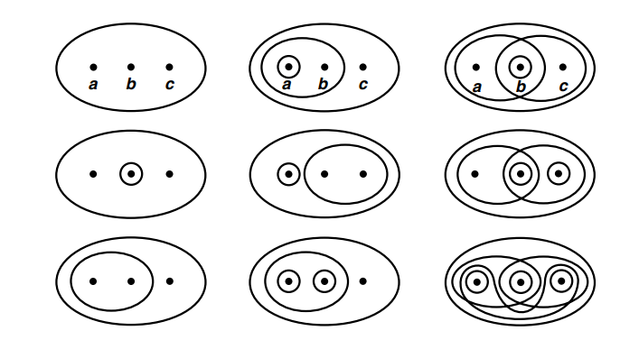
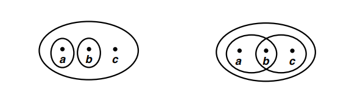
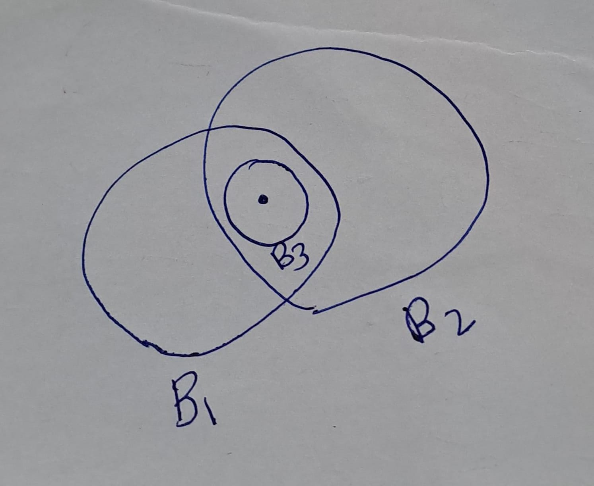
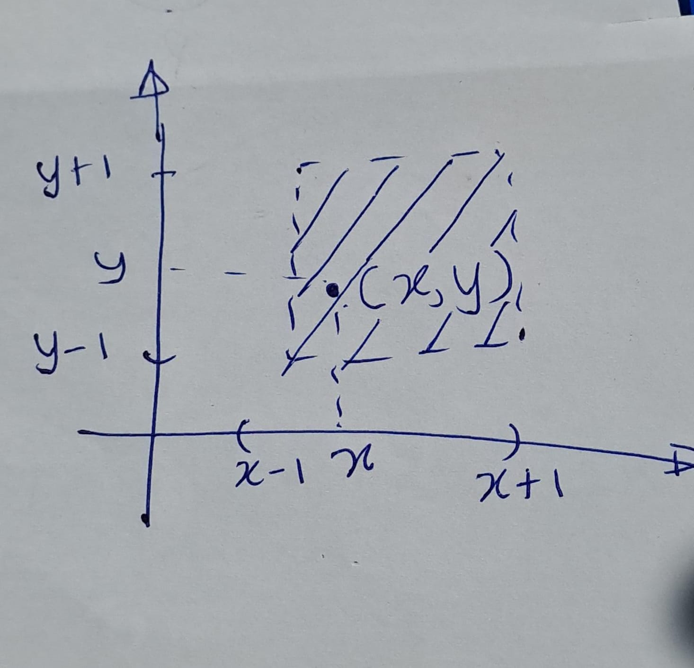
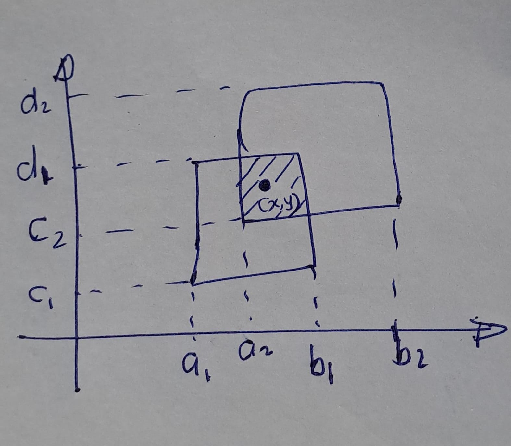
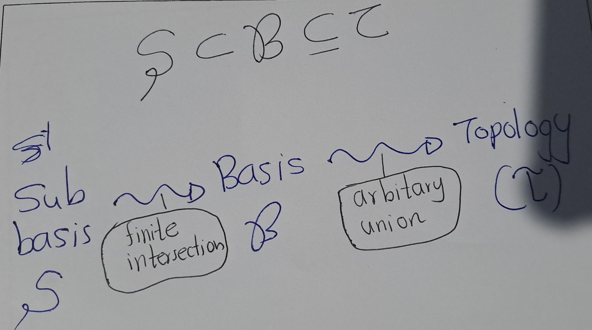

# Topology
A topology is a geometric structure defined on a set. Basically it is given by declaring which subsets are "open" sets. Thus the axioms are the abstraction of the properties that open sets have.

## Topological Spaces
::: {.definition #Top}
A topology on a set $X$ is a collection $\mathcal{T}$ of subsets of $X$ such that

(T1) $\phi$ and $X$ are in $\mathcal{T}$;

(T2) Any union of subsets in $\mathcal{T}$ is in $\mathcal{T}$;

(T3) The finite intersection of subsets in $\mathcal{T}$ is in $\mathcal{T}$.

:::

A set $X$ with a topology $\mathcal{T}$ is called a topological space. Denoted by $(X,\mathcal{T})$. An element of $\mathcal{T}$ is called an open set.

::: {.example #unnamed-chunk-1}
Let $X$ be a three-element set, $X = \{a, b, c\}$ and $\mathcal{T}=\{X, \emptyset,\{a, b\}, \{b\}, \{b, c\}\}$. We can check T1,T2 and T3 conditions.
:::
::: {.example #unnamed-chunk-2}
Let $X$ be a three-element set, $X = \{a, b, c\}$ as pervoius. There are many possible topologies on $X$, some of which are indicated schematically in figure \@ref(fig:gi). Furthur, we can see that even a three-element set has many different topologies.
:::

 

::: {.remark}
 Not every collection of subsets of $X$ is a topology on $X$. Observe that Neither of the collections indicated in figure \@ref(fig:fig2) is a topology. 
 
First let's consider the left hand coner of figure  \@ref(fig:fig2). $\{a\}$ and $\{b\}$ in the collection, but $\{a\}\cup \{b\}$ is not in the collection.

Now consider the right hand coner figure. $\{a,b\}$ and $\{b,c\}$ in collection, but $\{a,b\}\cap\{b,c\}=\{b\}$ is not in the collection.
:::


 

::: {.example #unnamed-chunk-4}
If $X$ is any set, the collection of all subsets of $X$ (Power set) is a topology on $X$. This trivail statified T1 T2 and T3 conditions. Furthur,This is called the _discrete topology_. 
:::
::: {.example #unnamed-chunk-5}
The collection consisting of $X$ and $\emptyset$ only is also a topologyon $X$. we shall call it the _indiscrete topology_, or the trivial topology.
:::

::: {.example #unnamed-chunk-6}
Let $X$ be a set and let $\mathcal{T}_f$ be the collection of all subsets U of X such that $X\setminus U$ either is finite or is all of $X$. In oter words,
\[\mathcal{T}_f:=\left\{U\subseteq X : \text{Either is finite or is all of } X\right\}\]
Let's check is $\mathcal{T}_f$ a topology. First obseve that both $X$ and $\emptyset$ are in $\mathcal{T}_f$ , because $X\setminus X=\emptyset$ is finite and $X\setminus \emptyset $ is all of $X$.So $\mathcal{T}_f$ statified the T1 condition. Now let's check the T2 condition. Let $\{U_{\alpha}:\alpha\in I, I \text{ is index set}\}$.Now we need to show that $\cup{\alpha\in I} U_\alpha\in \mathcal{T}_f$. So consider,
\[X\setminus \bigcup_{\alpha\in I} U_\alpha =\bigcap_{\alpha\in I} (X\setminus  U_\alpha).\]
Now obsevere that $\cap_{\alpha\in I} (X\setminus  U_\alpha)$ is finite, because each set $(X\setminus  U_\alpha)$ is finite and arbitary intersection of finite sets is finite. So, $\mathcal{T}_f$ stattified the T2 condition also.
Finaly check the last condition, T3 condition. Let $U_1,...,U_n$ are nonempty elements of $\mathcal{T}_f$ , to show that $\bigcup_i U_i \in \mathcal{T}_f$ , we compute
\[X\setminus \bigcap_{i=1}^n U_i = \bigcup_{i=1}^n(X \setminus U_i).\]
Note that the set $\bigcup_{i=1}^n(X \setminus U_i)$ is a finite union of finite sets and, therefore, finite. So it statisfiy the T3 condition also.  Thefore $\mathcal{T}_f$ is a topology. Furthur $\mathcal{T}_f$ is called the finite _complement topology_.
:::

::: {.example #unnamed-chunk-7}
 Let $X$ be a set. Define $\mathcal{T}$ to be the collection of all subsets $U$ of $X$ such that $X\setminus U$ either is finite or is all of $X$. Then $\mathcal{T}$ defines a topology on $X$, called finite complement topology of $X$.
:::


##  Basis of a Topology
Once we define a structure on a set, often we try to understand what the minimum data you need to specify the structure. In many cases, this minimum data is called a basis and we say that the basis generate the structure. The notion of a basis of the structure will help us to describe examples more systematically.

::: {.definition #unnamed-chunk-8}
Let $X$ be a set. A basis of a topology on $X$ is a collection $\mathcal{B}$ of subsets in $X$ such that

(B1) For every $x \in X$, there exist an element $B$ in $\mathcal{B}$ such that $x \in B$.

(B2) If $x \in B_{1} \cap B_{2}$ where $B_{1}, B_{2}$ are in $\mathcal{B}$, then there is $B_{3}$ in $\mathcal{B}$ such that $x \in B_{3} \subseteq B_{1} \cap B_{2}$.

:::
 

::: {.lemma #unnamed-chunk-9 name="Generating of a topology"}
Let $\mathcal{B}$ be a basis of a topology on X. Define $\mathcal{T}_{\mathcal{B}}$ to be the collection of subsets $U \subset X$ satisfting

(G1) For every $x \in U$, there is $B \in \mathcal{B}$ such that $x \in B \subset U$.

Then $\mathcal{T}_{\mathcal{B}}$ defines a topology on $X$. Here we assume that $\emptyset$ trivially satisfies the condition, so that $\emptyset \in \mathcal{T}_{\mathcal{B}}$.
:::
::: {.proof}
We need to check the three axioms:

- (T1) $\emptyset \in \mathcal{T}_{\mathcal{B}}$ as we assumed. $X \in \mathcal{T}_{\mathcal{B}}$ by (B1).

- (T2) Consider a collection of subsets $U_{\alpha} \in \mathcal{T}_{\mathcal{B}}, \alpha \in \mathrm{J}$. We need to show

$$
U:=\bigcup_{\alpha \in J} U_{\alpha} \quad \in \mathcal{T}_{\mathcal{B}}
$$
By the definition of the union, for each $x \in U$, there is $U_{\alpha}$ such that $x \in U_{\alpha}$. Since $U_{\alpha} \in \mathcal{T}_{\mathcal{B}}$, there is $B \in \mathcal{B}$ such that $x \in B \subset U_{\alpha}$. Since $U_{\alpha} \subset U$, we found $B \in \mathcal{B}$ such that $x \in B \subset U$. Thus $U \in \mathcal{T}_{\mathcal{B}}$. 

- (T3) Now consider a finite number of subsets $U_{1},..., U_{n} \in \mathcal{T}_{\mathcal{B}}$. We need to show that
$$
U':=\bigcap_{i=1}^{n} U_{i} \quad \in \mathcal{T}_{\mathcal{B}}
$$

- Let's just check for two subsets $U_{1}, U_{2}$ first. For each $x \in U_{1} \cap U_{2}$, there are $B_{1}, B_{2} \in \mathcal{B}$ such that $x \in B_{1} \subset U_{1}$ and $x \in B_{2} \subset U_{2}$. This is because $U_{1}, U_{2} \in \mathcal{T}_{\mathcal{B}}$ and $x \in U_{1}, x \in U_{2}$. By (B2), there is $B_{3} \in \mathcal{B}$ such that $x \in B_{3} \subset B_{1} \cap B_{2}$. Now we found $B_{3} \in \mathcal{B}$ such that $x \in B_{3} \subset U$.

- We can generalize the above proof to $n$ subsets, but let's use induction to prove it. This is going to be the induction on the number of subsets.
  - When $n=1$, the claim is trivial.
  - Suppose that the claim is true when we have $n-1$ subsets, i.e. $U_{1} \cap \cdots \cap U_{n-1} \in \mathcal{T}_{\mathcal{B}}$. Since $$
U=U_{1} \cap \cdots \cap U_{n}=\left(U_{1} \cap \cdots \cap U_{n-1}\right) \cap U_{n}
$$
and regarding $U^{\prime}:=U_{1} \cap \cdots \cap U_{n-1}$, we have two subsets case $U=U^{\prime} \cap U_{n}$. By the first arguments, $U \in \mathcal{T}_{\mathcal{B}}$.
:::

::: {.definition #unnamed-chunk-11}
$\mathcal{T}_{\mathcal{B}}$ is called the **topology generated by a basis $\mathcal{B}$**. On the other hand, if $(X, \mathcal{T})$ is a topological space and $\mathcal{B}$ is a basis of a topology such that $\mathcal{T}_{\mathcal{B}}=\mathcal{T}$, then we say $\mathcal{B}$ is a basis of $\mathcal{T}$. Note that $\mathcal{T}$ itself is a basis of the topology $\mathcal{T}$. So there is always a basis for a given topology.

:::

::: {.example #unnamed-chunk-12}
- (Standard Topology of $\mathbb{R}$ ) Let $\mathbb{R}$ be the set of all real numbers. Let $\mathcal{B}$ be the collection of all open intervals:
$$
(a, b):=\{x \in \mathbb{R} \mid a<x<b\}
$$
Then $\mathcal{B}$ is a basis of a topology and the topology generated by $\mathcal{B}$ is called the standard topology of $\mathbb{R}$.

- Let $\mathbb{R}^{2}$ be the set of all ordered pairs of real numbers, i.e. $\mathbb{R}^{2}:=\mathbb{R} \times \mathbb{R}$ (cartesian product). Let $\mathcal{B}$ be the collection of cartesian product of open intervals, $(a, b) \times(c, d)$. Then $\mathcal{B}$ is a basis of a topology and the topology generated by $\mathcal{B}$ is called the standard topology of $\mathbb{R}^{2}$.

- (Lower limit topology of $\mathbb{R}$ ) Consider the collection $\mathcal{B}$ of subsets in $\mathbb{R}$ :
$$
\mathcal{B}:=\{[a, b):=\{x \in \mathbb{R} \mid a \leq x<b\} \mid a, b \in \mathbb{R}\}
$$
This is a basis for a topology on $\mathbb{R}$. This topology is called the lower limit topology.
:::
The following two lemma are useful to determine whehter a collection $\mathcal{B}$ of open sets in $\mathcal{T}$ is a basis for $\mathcal{T}$ or not.

::: {.remark}
Let $\mathcal{T}$ be a topology on $X$. If $\mathcal{B} \subset \mathcal{T}$ and $\mathcal{B}$ satisfies (B1) and (B2), it is easy to see that $\mathcal{T}_{\mathcal{B}} \subset \mathcal{T}$. This is just because of (G1). If $U \in \mathcal{T}_{\mathcal{B}}$, (G1) is satisfied for $U$ so that $\forall x \in U, \exists B_{x} \in \mathcal{B}$ such that $x \in B_{x} \subset U$. Therefore $U=\cup_{x \in U} B_{x}$. By (T2), $U \in \mathcal{T}$.
:::
::: {.lemma #unnamed-chunk-14}
Let $(X, \mathcal{T})$ be a topological space. Let $\mathcal{B} \subset \mathcal{T}$. Then $\mathcal{B}$ is a basis and $\mathcal{T}_{\mathcal{B}}=\mathcal{T}$ if and only if $\mathcal{T}$ is the set of all unions of elements in $\mathcal{B}$.
:::
::: {.proof}
- $\quad(\Rightarrow)$ Let $\mathcal{T}^{\prime}$ be the set of all unions of open sets in $\mathcal{B}$. If $U \in \mathcal{T}$, then $U$ satisfies (G1), i.e. $\forall x \in U, \exists B_{x} \in \mathcal{B}$ s.t. $x \in B_{x} \subset U$. Thus $U=\cup_{x \in U} B_{x}$. Therefore $U \in \mathcal{T}^{\prime}$. We proved $\mathcal{T} \subset \mathcal{T}^{\prime}$. It follows from (T2) that $\mathcal{T}^{\prime} \subset \mathcal{T}$.
- $(\Leftarrow)$ Since $X \in \mathcal{T}, X=\cup_{\alpha} B_{\alpha}$ some union of sets in $\mathcal{B}$. Thus $\forall x \in X, \exists B_{\alpha}$ s.t. $x \in B_{\alpha}$. This proves (B1) for $\mathcal{B}$. If $B_{1}, B_{2} \in \mathcal{B}$, then $B_{1} \cap B_{2} \in \mathcal{T}$ by (T2). Thus $B_{1} \cap B_{2}=\cup_{\alpha} B_{\alpha}, B_{\alpha} \in \mathcal{B}$. So $\forall x \in B_{1} \cap B_{2}, \exists B_{\alpha} \in B$ s.t. $x \in B_{\alpha}$. This $B_{\alpha}$ plays the role of $B_{3}$ in (B2). Thus $\mathcal{B}$ is a basis. Now it makes sense to consider $\mathcal{T}_{\mathcal{B}}$ and we need to show $\mathcal{T}_{\mathcal{B}}=\mathcal{T}$. By the remark, we already know that $\mathcal{T}_{\mathcal{B}} \subset \mathcal{T}$. On the other hand, if $U \in \mathcal{T}$, then $U=\cup_{\alpha} B_{\alpha}, B_{\alpha} \in \mathcal{B}$. Hence, $\forall x \in U, \exists B_{\alpha}$ such that $x \in B_{\alpha} \subset U$. Thus (G1) is satisfied for $U$. Thus $U \in \mathcal{T}_{\mathcal{B}}$. This proves $\mathcal{T}_{\mathcal{B}} \supset \mathcal{T}$.
:::

::: {.lemma #unnamed-chunk-16}
Let $(X, \mathcal{T})$ be a topological space. Let $\mathcal{B} \subset \mathcal{T}$. Then $\mathcal{B}$ is a basis and $\mathcal{T}_{\mathcal{B}}=\mathcal{T}$ if and if any $U \in \mathcal{T}$ satisfies (Gl), i.e. $\forall x \in U, \exists B_{x} \in \mathcal{B}$ s.t. $x \in B_{x} \subset U$.
:::
::: {.proof}
- ($\Rightarrow$) Trivial by the definition of $\mathcal{T}_{\mathcal{B}}$.

- ($\Leftarrow X$) satisfies (G1) so $\mathcal{B}$ satisfies (B1). Let $B_{1}, B_{2} \in \mathcal{B} \subset \mathcal{T}$. By (T3), $B_{1} \cap B_{2} \in \mathcal{T}$. Thus $B_{1} \cap B_{2}$ satisfies (G1). This means (B2) holds for $\mathcal{B}$. Thus $\mathcal{B}$ is a basis. Now the assumption can be rephrased as $\mathcal{T} \subset \mathcal{T}_{\mathcal{B}}$. By the remark above, we already know $\mathcal{T} \supset \mathcal{T}_{\mathcal{B}}$.

:::

## Comparing Topologies
::: {.definition #unnamed-chunk-18}
Let $\mathcal{T}, \mathcal{T}^{\prime}$ be two topologies for a set $X$. We say $\mathcal{T}^{\prime}$ is finer than $\mathcal{T}$ or $\mathcal{T}$ is coarser than $\mathcal{T}^{\prime}$ if $\mathcal{T} \subset \mathcal{T}^{\prime}$. The intuition for this notion is " $\left(X, \mathcal{T}^{\prime}\right)$ has more open subsets to separate two points in $X$ than $(X, \mathcal{T})$ ".

:::
::: {.lemma #unnamed-chunk-19}
Let $\mathcal{B}, \mathcal{B}^{\prime}$ be bases of topologies $\tau, \tau^{\prime}$ on $X$ respectively. Then $\tau^{\prime}$ is finer than $\tau \Leftrightarrow$ $\forall B \in \mathcal{B}$ and $\forall x \in B, \exists B^{\prime} \in \mathcal{B}^{\prime}$ s.t. $x \in B^{\prime} \subset B$.

:::
::: {.proof}
- $\Rightarrow$ Since $\mathcal{B} \subset \tau \subset \tau^{\prime}$, all subsets in $\mathcal{B}$ satisfies (G1) for $\tau^{\prime}$, which is exactly the statement we wanted to prove. 

- $\Leftarrow$ The LHS says $\mathcal{B} \subset \tau^{\prime}$. We need to show that it implies that any $U \in \tau$ satisfies (G1) for $\tau^{\prime}$ too.
$$
\forall U \in \tau, \forall x \in U, \exists B \in \mathcal{B} \text { s.t. } x \in B \subset U
$$But$$
\forall B \in \mathcal{B}, \forall x \in B, \exists B^{\prime} \in \mathcal{B}^{\prime} \text { s.t. } x \in B^{\prime} \subset B .
$$
Combining those two,
$$
\forall U \in \tau, \forall x \in U, \exists B^{\prime} \in \mathcal{B}^{\prime} \text { s.t. } x \in B^{\prime} \subset B \subset U .
$$

:::
## Product Toplogy on $X \times Y$.
The Cartesian product of two topological spaces has an induced topology called the product topology. There is also an induced basis for it. Here is the example to keep in mind:

```{example}Recall that the standard topology of $\mathbb{R}^{2}$ is given by the basis

$$
\mathcal{B}:=\left\{(a, b) \times(c, d) \subset \mathbb{R}^{2} \mid a<b, c<d\right\}
$$
```

::: {.proof}
(Proof of $\mathcal{B}$ is basis.)
- (B1) Let $(x,y)\in \mathbb{R}^2$. Then observe that $x\in(x-1,x+1)\subseteq \mathbb{R}$, and $y\in(y-1,y+1)\subseteq \mathbb{R}$. Thus
\[(x,y)\in (x-1,x+1)\times (y-1,y+1).\]

See figure \@ref(fig:fig4).
Therefore, this satisfied the B1 condition.

- Now supposose that $(x,y)\in (a_1,b_1)\times(c_1,d_1)\cap (a_2,b_2)\times(c_2,d_2)$
Now observe
$(x,y)\in (a_1,b_1)\times(c_1,d_1)\implies x\in(a_1,b_1)$ and $y\in(c_1,d_1)$

and

$(x,y)\in (a_2,b_2)\times(c_2,d_2)\implies x\in(a_2,b_2)$ and $y\in(c_2,d_2)$
Let $a=\max\{a_1,a_2\},b=\min\{b_1,b_2\}, c=\max\{c_1,c_2\}$ and $d=\min\{d_1,d_2\}$. Then observe that 
\[x\in (a,b)\quad \text{and} y\in (c,d)\].
Further, $$(x,y)\in (a,b)\times (c,d)\subseteq (a_2,b_2)\times(c_2,d_2)\implies x\in(a_2,b_2)$$. 
See figure \@ref(fig:fig5).
This satisfies B2 condition.
:::

 
 

::: {.definition #unnamed-chunk-22}
If $\left(X, \tau_{X}\right)$ and $\left(Y, \tau_{Y}\right)$ are topological spaces, then the collection $\mathcal{B}$ of subsets of the form $U \times V \subset X \times Y, U \in \tau_{X}, V \in \tau_{Y}$ forms a basis of a topology. The topology generated by $\mathcal{B}$ is called product topology on $X \times Y$.

:::
::: {.proof}
(Proof of $\mathcal{B}$ is basis)
(B1) Let $(x, y) \in X \times Y$ be an arbitrary element. We need to find a subset in $\mathcal{B}$ containing $(x, y)$, but since $X \times Y \in \mathcal{B}$, it is obvious.

(B2) For any $U_{1} \times V_{1}, U_{2} \times V_{2} \in \mathcal{B}$, the intersection is $\left(U_{1} \times V_{1}\right) \cap\left(U_{2} \times V_{2}\right)=\left(U_{1} \cap U_{2}\right) \times\left(V_{1} \cap V_{2}\right) \in \mathcal{B}$. So it is obvious again.

:::

::: {.definition #unnamed-chunk-24 name="subbasis"}
Let $X$ be a set.A subbasis \mathcal{S} for a topology on $X$ is a collection of subsets of $X$ whose union equals $X$. 
\[\left(\text{i.e. }\forall x\in X ~\exists S\in\mathcal{S} \text{  such that } x\in S\right)\]
:::


 

::: {.definition #unnamed-chunk-25}
The topology generated by the subbasis \mathcal{S} is defined to be the collection T of all unions of finite intersections of elements of \mathcal{S}.
:::

<!--chapter:end:index.Rmd-->

# Chapter 2 name

<!--chapter:end:01-Basis.Rmd-->

# Chapter 03 name
Up to there is none.

<!--chapter:end:02-Contnuous_Functions.Rmd-->

