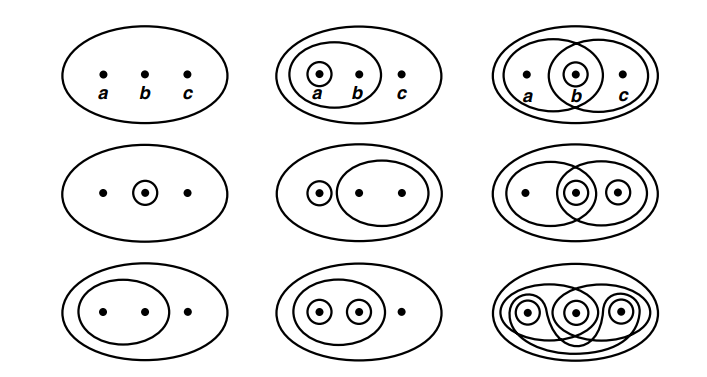

# Topology
A topology is a geometric structure defined on a set. Basically it is given by declaring which subsets are "open" sets. Thus the axioms are the abstraction of the properties that open sets have.

## Topological Spaces
```{definition,label="Top"}
A topology on a set $X$ is a collection $\mathcal{T}$ of subsets of $X$ such that

(T1) $\phi$ and $X$ are in $\mathcal{T}$;

(T2) Any union of subsets in $\mathcal{T}$ is in $\mathcal{T}$;

(T3) The finite intersection of subsets in $\mathcal{T}$ is in $\mathcal{T}$.

```

A set $X$ with a topology $\mathcal{T}$ is called a topological space. Denoted by $(X,\mathcal{T})$. An element of $\mathcal{T}$ is called an open set.

```{example}
Let $X$ be a three-element set, $X = \{a, b, c\}$ and $\tau=\{X, \emptyset,\{a, b\}, \{b\}, \{b, c\}\}$. We can check T1,T2 and T3 conditions.
```
```{example}
Let $X$ be a three-element set, $X = \{a, b, c\}$ as pervoius. There are many possible topologies on $X$, some of which are indicated schematically in figure \@ref(fig:gi). Furthur, we can see that even a three-element set has many different topologies.
```

```{r echo=FALSE,fig.cap='$~$',label='gi'}
   
```

```{remark}
 Not every collection of subsets of $X$ is a topology on $X$. Observe that Neither of the collections indicated in figure \@ref(fig:fig2) is a topology. 
 
First let's consider the left hand coner of figure  \@ref(fig:fig2). $\{a\}$ and $\{b\}$ in the collection, but $\{a\}\cup \{b\}$ is not in the collection.

Now consider the right hand coner figure. $\{a,b\}$ and $\{b,c\}$ in collection, but $\{a,b\}\cap\{b,c\}=\{b\}$ is not in the collection.
```


```{r echo=FALSE,fig.cap='$~$',label='fig2'}
  knitr::include_graphics("figure 02.png") 
```

```{example}
If $X$ is any set, the collection of all subsets of $X$ (Power set) is a topology on $X$. This trivail statified T1 T2 and T3 conditions. Furthur,This is called the _discrete topology_. 
```
```{example}
The collection consisting of $X$ and $\emptyset$ only is also a topologyon $X$. we shall call it the _indiscrete topology_, or the trivial topology.
```

```{example}
Let $X$ be a set and let $\tau_f$ be the collection of all subsets U of X such that $X\setminus U$ either is finite or is all of $X$. In oter words,
\[\tau_f:=\left\{U\subseteq X : \text{Either is finite or is all of } X\right\}\]
Let's check is $\tau_f$ a topology. First obseve that both $X$ and $\emptyset$ are in $\tau_f$ , because $X\setminus X$ is finite and $X\setminus \emptyset $ is all of $X$.So $\tau_f$ statified the T1 condition. Now let's check the T2 condition. Let $\{U_{\alpha}:\alpha\in I, I \text{is index set}\}$.Now we need to show that $\cup{\alpha\in I} U_\alpha\in \tau_f$. So consider,
\[X\setminus \cup_{\alpha\in I} U_\alpha =\cap_{\alpha\in I} (X\setminus  U_\alpha).\]
Now obsevere that \cap_{\alpha\in I} (X\setminus  U_\alpha) is finite, because each set $(X\setminus  U_\alpha)$ is finite and arbitary intersection of finite sets is finite. So, $\tau_f$ stattified the T2 condition also.
Finaly check the last condition, T3 condition. Let $U_1,...,U_n$ are nonempty elements of $\tau_f$ , to show that $\Cup_i U_i \in \tau_f$ , we compute
\[X\setminus \cap_{i=1}^n U_i = \cup_{i=1}^n(X \setminus U_i).\]
Note that the set $\cup_{i=1}^n(X \setminus U_i)$ is a finite union of finite sets and, therefore, finite. So it statisfiy the T3 condition also.  Thefore $\tau_f$ is a topology. Furthur $\tau_f$ is called the finite _complement topology_.
```

```{example}
 Let $X$ be a set. Define $\mathcal{T}$ to be the collection of all subsets $U$ of $X$ such that $X\setminus U$ either is finite or is all of $X$. Then $\mathcal{T}$ defines a topology on $X$, called finite complement topology of $X$.
```


##  Basis of a Topology
Once we define a structure on a set, often we try to understand what the minimum data you need to specify the structure. In many cases, this minimum data is called a basis and we say that the basis generate the structure. The notion of a basis of the structure will help us to describe examples more systematically.

```{definition}
Let $X$ be a set. A basis of a topology on $X$ is a collection $\mathcal{B}$ of subsets in $X$ such that

(B1) For every $x \in X$, there exist an element $B$ in $\mathcal{B}$ such that $x \in B$.

(B2) If $x \in B_{1} \cap B_{2}$ where $B_{1}, B_{2}$ are in $\mathcal{B}$, then there is $B_{3}$ in $\mathcal{B}$ such that $x \in B_{3} \subseteq B_{1} \cap B_{2}$.

```

```{lemma,name='Generating of a topology'}
Let $\mathcal{B}$ be a basis of a topology on X. Define $\mathcal{T}_{\mathcal{B}}$ to be the collection of subsets $U \subset X$ satisfting

(G1) For every $x \in U$, there is $B \in \mathcal{B}$ such that $x \in B \subset U$.

Then $\tau_{\mathcal{B}}$ defines a topology on $X$. Here we assume that $\varnothing$ trivially satisfies the condition, so that $\varnothing \in \tau_{\mathcal{B}}$.
```
```{proof}
We need to check the three axioms:
  
```